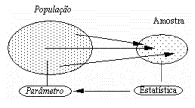
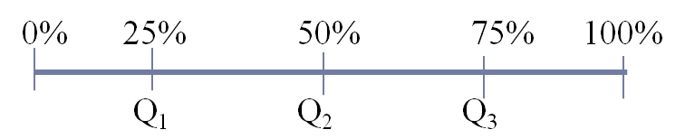
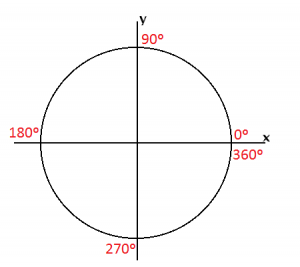
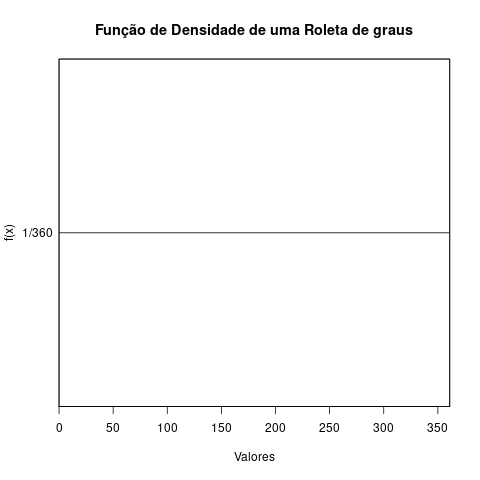
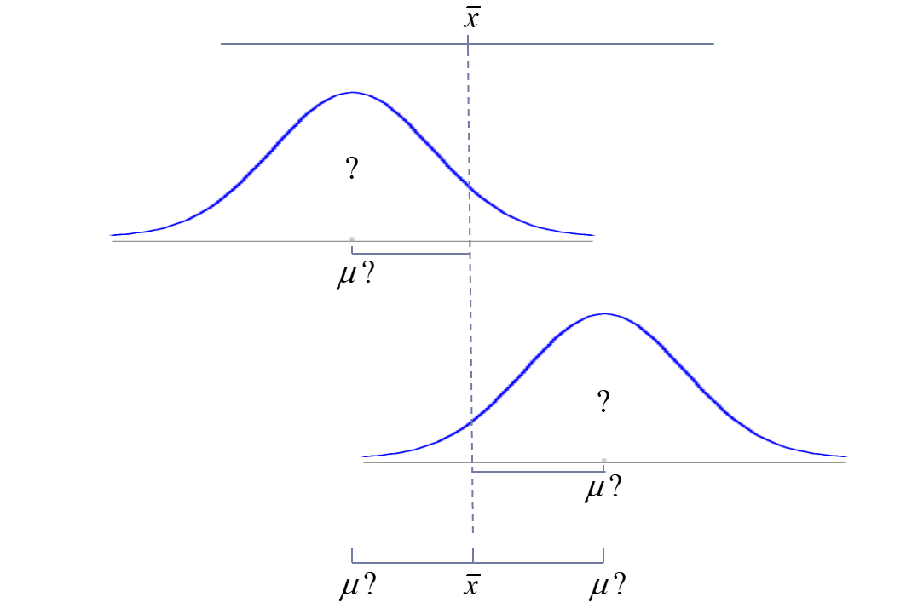
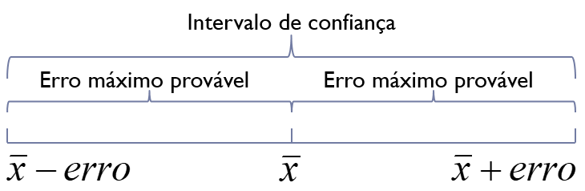

# Termos Básicos

- **População**: é o conjunto de objetos, indivíduos ou resultados experimentais acerca do qual se pretende estudar alguma característica.
- **Amostra**: parte representativa dos elementos de uma população.
- **Amostragem**: processo de seleção de amostra.
- **Variável**: qualidade ou quantidade, medida ou registrada para cada sujeito da amostra.
    - Ex.: sexo, idade, resistência.
- **Variável aleatória**: é uma variável cujo valor não é conhecido até seja observada, logo não pode ser previsto com certeza.
- **Observação**: unidade de estudo, sujeito ou indivíduos.
- **Parâmetro**: característica da população
    - Ex.: Quantidade de indivíduos, valor médio ($\mu$), a nota média de uma escola, desvio padrão ($\sigma$).
- **Estimação**: processo de utilizar dados amostrais para estimar os valores dos parâmetros populacionais desconhecidos.
    - Ex.: nota média amostral ($\bar{x}$), desvio-padrão amostral ($s$).
- **Estimador**: função (fórmula) que estima um parâmetro a partir de dados amostrais.
$$\bar{x}=\dfrac{\sum\limits_ {i=1}^n x}{n}$$
- **Estimativa (estatística)**: o valor da estimativa.
$$\bar{x}=\dfrac{4+5+6}{3}=5$$


```{r}
#| echo: false
#| fig-cap: "População e amostra"
#| label: fig-pop_amostra
#| fig-align: center


```


## Classificação das variáveis
 - Qualitativas
    - Categóricas (nominais)
    - Ordinais

 - Quantitativas
    - Discretas
    - Contínuas


## Tipos de comparações das amostras


```{r}
#| echo: false
#| fig-cap: "Independentes (Não Pareadas ou Não relacionadas)"
#| label: fig-independentes
#| fig-align: center


```


```{r}
#| echo: false
#| fig-cap: "Dependentes (Pareadas ou Relacionadas)"
#| label: fig-dependentes
#| fig-align: center


```


# Estatísticas descritivas

A análise de dados deve iniciar com análise exploratória através da inspeção das estatísticas descritivas, tabelas e de seus aspectos visuais com propósito de compreender melhor seu comportamento, tendências, variabilidade e identificar eventuais de valores atípicos (*outliers*).

As medidas estatística descritas na tabela a seguir são aplicáveis somente a **dados quantitivos** (variáveis discretas e contínuas).


| Medida            |Equação                      |Comandos no R| Pacote |
|-------------------|-----------------------------|-------------|--------|
|média              |$\bar{x}=\dfrac{\sum\limits_ {i=1}^n x}{n}$|`mean(x)`|Base
|Mediana            |                                         |`median(x)`|Base
|Amplitude              |$A=x_{max}-x_{min}$              |`range(x)`|Base
|variância|$s^2=\dfrac{\sum\limits_{i=1}^n (x_i-\bar{x})^2}{n-1}$|`var(x)`|Base
|Desvio-padrão          |$s=\sqrt{s^2}$                           |`sd(x)`|Base
|Coeficiente de variação|$cv=\dfrac{s}{\bar{x}}$          |`sd(x)/mean(x)`|Base
|Erro-padrão|$ep=\sqrt{\dfrac{s^2}{n}}$  ou  $ep=\dfrac{s}{\sqrt{n}}$ |`s/sqrt(length(x))`|Base
|Quartis                |                                  | `quantile(x)`|Base
|Intervalo Inter-quartil|$IQR=q_3-q_1$|`IQR(x)`                          |Base
|Decis||`quantile(x, seq(from=0.1, to=0.9, 0.1))`|Base
|Centis||`quantile(x, .01)# 1o centil`|Base
|Mínimo e Máximo|                                        |`min(x)` e `max`|Base
|Assimetria||`skewness(x)`|e1071
|Curtose| |`kurtosis(x)`|e1071

## Medidas de posição central
A **média aritmética** de uma amostra, é um número que, levando em conta o total de elementos da amostra, pode substituir a todos, sem alterar determinada característica desse conjunto.

A **mediana** é valor que ocupa a posição central da listagem, estando a amostra com seus valores em ordem crescente ou decrescente e com todos os valores repetidos também incluídos, individualmente, na lista ordenada. Quando a quantidade de valores é ímpar, a mediana da amostra é o valor que ocupa a posição, central, posição única. Quando a quantidade de valores é par, há duas posições centrais na lista ordenada; então a mediana da amostra é a média aritmética dos valores que ocupam as posições centrais.

## Medidas de dispersão
A **amplitude** é a diferença entre o maior e o menor valor

A **Variância** é uma medida de dispersão dos dados em relação é média, medida em unidades ao quadro dos dados.

O **desvio padrão** é uma medida de dispersão e o seu valor reflete a variabilidade das observações em relação é média. O erro padrão da estimativa diminui com o aumento do tamanho da amostra, refletindo o aumento de precisão da estimativa com o tamanho da amostra. Se o objetivo é descrever a variabilidade observada numa amostra deve-se utilizar o desvio padrão.

O **erro padrão** é uma medida do erro envolvido na estimação de um parâmetro a partir de uma amostra. É usual apresentar a média e o erro padrão da média com a indicação $(\bar{x}\pm e)$. Indica a imprecisão associada à estimativa de um determinado parâmetro (e.g. média).

O **coeficiente de variação** fornece uma medida de variabilidade dos dados em relação à média. Quando menor for o CV, mais homogênea é a amostra ou experimento. A classificação do CV depende do processo que se estuda.

classificação do CV segundo Pimentel e Gomes (1985), baseada em ensaios agrícolas.

|valor de CV           |classificação|Interpretação
|---------------------:|-------------|------------
|$CV\leq 10\%$         |Baixo        |Baixa dispersão dos dados
|$10\% < CV \leq 20\%$ |Médio        |Média dispersão dos dados
|$20\% < CV \leq  30\%$|Alto         |Alta dispersão dos dados     
|$CV >30\%$            |Muito Alto   |Dispersão muito alta dos dados 

## Medidas de posição não central
Os **quartis (Q1, Q2 e Q3)**: são valores que dividem a distribuição da amostra ordenada em ordem crescente em quatro partes iguais. O primeiro quartil, Q1, é o número que deixa 25% das observações abaixo, o terceiro quartil, Q3, deixa 75% das observações abaixo.


```{r}
#| echo: false
#| fig-cap: "Quartis da distribuição"
#| label: fig-quartis
#| fig-align: center


```


Os **decis (D1, D2, ..., D9)** dividem os dados em dez partes (cada parte tem 10% dos dados).

Os **percentis (P1, P2, ..., P99)** dividem os dados em centésimas partes (cada parte tem 1% dos dados).

**Assimetria** é uma medidade de assimetria da distribuição.

```{r}
#| echo: false
#| fig.hight: 3
#| fig.width: 9
#| fig.cap: "Assimetria"
#| label: "fig-assimetria"

set.seed(2107)

# Distribuição assimétrica (à esquerda)
x_left <- rbeta(1000, 50, 2) * 10

# Espelho perfeito (à direita)
x_right <- max(x_left) - x_left

# Dois gráficos lado a lado
par(mfrow = c(1, 2))

# Painel da esquerda — assimetria à esquerda
hist(x_left, breaks = 30, col = "grey", border = "white",
     main = "Assimetria negativa (esquerda)", freq = FALSE, xlab = "",
     axes = FALSE, ylab = "")
lines(density(x_left), col = "red", lwd = 1.5)

# Painel da direita — espelho (assimetria à direita)
hist(x_right, breaks = 30, col = "grey", border = "white",
     main = "Assimetria positiva (direita)", freq = FALSE, xlab = "",
     axes = FALSE, ylab = "")
lines(density(x_right), col = "red", lwd = 1.5)
```


<br>
**Curtose** é uma medida que caracteriza o achatamento da distribuição de frequência em relação à curva normal padrão (Gauss).

```{r}
#| echo: false
#| fig.cap: "Curtose"
#| label: "fig-curtose"


# Curvas de curtose
plot(function(x) dnorm(x, 0, .8), -4, 4,
     ylim = c(0, .5),
     col = "#1B9E77", lwd = 3,
     xaxt = "n", yaxt = "n", ann = FALSE,
     bty = "n")

plot(function(x) dnorm(x, 0, 1.3), -4, 4,
     add = TRUE, col = "#D95F02", lwd = 3)

plot(function(x) dnorm(x, 0, 1), -4, 4,
     add = TRUE, col = "#7570B3", lwd = 3)

legend(1.8, 0.5,
       legend = c("Leptocúrtica", "Mesocúrtica", "Platicúrtica"),
       col = c("#1B9E77", "#7570B3", "#D95F02"),
       pch = 15, pt.cex = 2,
       bty = "n", cex = 1.2)

#title("Curtose", cex.main = 1.6)
```


Vamos analisar os dados de experimentos de tempo de vida útil de baterias em anos que estão no documento [**bateria.RData**](bateria.RData). Iniciamos importando os dados e examinado o objeto baterias que é um data frame que possui uma variável denominada vida_util, com 40 observações.

```{r}
# Importação, preparação e inspeção
load("bateria.RData") # carregar dados em .RData

names(bateria)
dim(bateria)
head(bateria)
str(bateria) # Estrutura resumida
```

Pode-se iniciar a análise examinando as estatísticas mais básicas como o comando `summary()`.

```{r}
#| warning: false

# Estatisticas descritivas

summary(bateria)
```

Contudo, talvez possamos preferir uma tabela personalizada de estatísticas, podendo inclusive gerar um data.frame que conterá nossas estatísticas. Para tanto, utilizaremos o comando `rbind()` que organiza nossos objetos em linhas (o `cbind()` organiza em colunas).

```{r}
#| warning: false

n <- length(bateria$vida_util) # No de obs.
xbar <- mean(bateria$vida_util) # média
md <- median(bateria$vida_util) # Mediana
var <- var(bateria$vida_util) #variância
s <- sd(bateria$vida_util)  # desvio-padrão
cv <- s/xbar*100 # Coeficiente de variação
ep <- s/sqrt(n) # erro-padrão
min.X <- min(bateria$vida_util)
max.X <- max(bateria$vida_util)
  
library(e1071)
skew.X <- skewness(bateria$vida_util)
kur.X <- kurtosis(bateria$vida_util)
# Tabela com estatísticas descritivas
vida.desc <- rbind(n,xbar, md,s,var,s, cv, ep, min.X,max.X, skew.X,kur.X) # em linhas
colnames(vida.desc) <- c("estatísticas")
vida.desc

quantile(bateria$vida_util)
```

```{r}
#| echo: false
#| fig.cap: "Observações dos tempos de vida útil de baterias em anos"
#| label: "fig-strip"
#| 
stripchart(bateria$vida_util, 
           method = "stack", 
           at = .1, 
           pch = 19)
title(xlab ="anos")

text(xbar, 1.0, "me")
arrows(xbar,.95,xbar,.4,length=.1, col = "red")

text(md, 0.85, "md")
arrows(md,.8,md,.4,length=.1, col = "blue")
```


## Gráficos

### Boxplot
O **Boxplot** é um gráfico que descreve a distribuição empírica dos dados, formado pelo o 1o quartil, a mediana, o 3o quartil e hastes inferiores e superiores que delimitam as observações típicas, os pontos fora destes limites são considerados dados discrepantes ou atípicos (outliers). Os limites são calculados a partir do intervalo interquartílico.

$$Linf=q1-1,5IQR$$
$$Lsup=q3+1,5IQR$$


```{r}
#| echo: false
#| fig.cap: "Boxplot"
#| label: "fig-boxplot"


load("bateria.RData")   # carregar dados

lab.size <- 0.9

# Fonte mais bonita
par(family = "serif", font = 3)   # serif + itálico
par(mai = c(0.8, 0.6, 0.6, 0.4))  # margens mais equilibradas


grafico <- boxplot(bateria$vida_util,
                   yaxt = "n",
                   col = "#E8E8E8",
                   border = "#555555",
                   boxwex = 0.4)

#title(main = "Boxplot", cex.main = 1.6)

# ---- Anotações ----

# Limite inferior
text(0.55, grafico$stats[1], "Lim. inferior", cex = lab.size)
arrows(0.65, grafico$stats[1], 0.80, grafico$stats[1],
       length = .1, angle = 20)

# 1º quartil
text(0.55, grafico$stats[2], "1º Quartil", cex = lab.size)
text(0.55, grafico$stats[2] - 0.15, "(25%)", cex = lab.size)
arrows(0.65, grafico$stats[2], 0.80, grafico$stats[2],
       length = .1, angle = 20)

# Mediana
text(0.55, grafico$stats[3], "Mediana", cex = lab.size)
text(0.55, grafico$stats[3] - 0.15, "(50%)", cex = lab.size)
arrows(0.65, grafico$stats[3], 0.80, grafico$stats[3],
       length = .1, angle = 20)

# 3º quartil
text(0.55, grafico$stats[4], "3º Quartil", cex = lab.size)
text(0.55, grafico$stats[4] - 0.15, "(75%)", cex = lab.size)
arrows(0.65, grafico$stats[4], 0.80, grafico$stats[4],
       length = .1, angle = 20)

# Limite superior
text(0.55, grafico$stats[5], "Lim. superior", cex = lab.size)
arrows(0.65, grafico$stats[5], 0.80, grafico$stats[5],
       length = .1, angle = 20)

# Outliers
for (i in seq_along(grafico$out)) {
  text(0.75, grafico$out[i], "Outlier", cex = lab.size)
  arrows(0.82, grafico$out[i], 0.95, grafico$out[i],
         length = .1, angle = 20)
}

# IQR
text(1.25, mean(grafico$stats[2:4]), "IQR", cex = lab.size)
arrows(1.20, grafico$stats[2], 1.20, grafico$stats[4],
       length = .1, angle = 20, code = 3)

```

O boxplot dos 40 ensaios de vidas úteis de baterias pode ser gerado com o  comando `boxplot()`.

```{r}
#| fig.cap: "Boxplot das observações de vidas úteis de baterias"
#| label: "fig-boxplot_baterias"

# gráficos
boxplot(bateria$vida_util, 
        ylab='Vida útil (anos)',
        las=1, 
        col='yellow')
points(xbar, pch='+', cex=2, col="red") # Média
```

O comando `points()` acrescenta o sinal "+" na posição da média, tornando o gráfico mais informativo.

As estatísticas utilizadas para a elaboração do boxplot podem ser acessadas. Para tanto, primeiramente, devem-se ser armazenadas num objeto que, neste exemplo, foi denominado meuBoxplot.

```{r}
#| results: "hide"
#| fig.show: "hide"
meuBoxplot<-boxplot(bateria$vida_util, ylab='Vida útil (anos)', las=1, col='Yellow')
```

Pode-se então exibir a lista de nomes das estatísticas armazenadas com o comando `names()`. No `out`, estão os valores dos *outliers*. 

```{r}
names(meuBoxplot)
meuBoxplot$out
```

Uma maneira muito simples de identificar os *outliers* no boxplot é disponibilizado pelo comando `Boxplot()` (com B maiúsculo) do pacote `car`.

```{r}
#| warning: false
#| fig.cap: "Boxplot com a identificão dos outliers"
#| label: "fig-boxplot_out"

library(car) # pacote car
Boxplot(bateria$vida_util,
        ylab='Vida útil (anos)',
        col="yellow", 
        las=1)

points(xbar, pch='+', cex=2, col="red") # média
```

Como se pode observar nos resultados do comando `Boxplot` e pelo gráfico, os tempos do 31o e do 10o ensaios de baterias são atípicos quando comparadas com os demais.

### Histograma

**Histogramas** são gráficos de barras em que as barra representam a frequência dos dados e seus respectivos intervalos. Esses interlavos não se sobrepõem e são os gráficos que representam as tabelas de distribuição de frequências.

```{r}
#| fig.cap: "Histograma das observações das vidas úteis de bateriais"
#| label: "fig-hist_bateriais"


hist(bateria$vida_util, col = "red")
```

### Exercício
Os dados da força de ruptura em libras por polegada quadrada para 100 garrafas descartáveis de 1 litro de refrigerante estão no arquivo [**dadosForca.R**](dadosForca.R). Essas medidas foram obtidas, testando-se cada garrafa até ocorrer a quebra. (FONTE: HINES et al. (2006), Tabela 8-2, p. 157).

Faça o que se pede:

 a) Importe os dados. **Dica:** use o comando `load()`.
 b) Calcule as estatísticas descritivas e gere uma tabela com essas medidas.
 c) Qual o valor da média amostral?
 d) Como a dispersão de dados pode ser classificada, segundo a clasificação de segundo Pimentel e Gomes (1985)?
 e) Elabore um boxplot e marque a localização da média na distribuição.
 f) Ao examinar o boxplot, pode-se afirmar que a distribuição é simétrica? Acrescente a assimetria medida para reforçar a análise.
 
# Probabilidades
Probabilidade exprime a chance de ocorrência de um evento. A probabilidade é um número relativo aos resultados possíveis que varia de zero a 1. A ocorrência do evento é denominado **sucesso** e **fracasso** a sua não ocorrência que o complemento dos possíveis resultados.

$$P(A)= \dfrac{n_x}{n}$$
$$0\leq P(x) \leq 1$$
$$P(x')=1-P(x)$$

$$\sum_{i=1}^{n}P(x)=1$$
O conjunto dos possíveis resultados que se pode obter é denominado espaço amostral $S$. Um exemplo do espaço amostral com os possíveis resultados do lançamento de duas moedas honestas (não-viciadas) é apresentado abaixo. 
$$S=\{CC,CK,KC,KK\}$$

Observa-me que 4 resultados possíveis e a probabilidade de cada resultado é $\frac{1}{4}=0,25$

Qual a probabilidade do lançamento de duas moeda honestas ser uma *K* (Cara) e qual a probabilidade do resultado ser diferente de cara?


$$P(CK)+P(KC)=(0,25)+(0,25)=0,50$$


## Distribuições de probabilidades

Uma distribuição de probabilidade é uma distribuição de frequências relativas para os resultados de um espaço amostral.

Mostra a proporção das vezes em que uma variável aleatória discreta tende a assumir cada um dos diversos valores.

{ width=60% }


<br><br>

A altura de cada barra indica a probabilidade de ocorrência de um evento.

```{r}
#| echo: false
#| fig.cap: "distribuição de Probabilidade\nde uma cara no lançamento de duas moedas"
#| label: fig-dist_freq_moedas

x<-c(0.25,0.50,0.25)
ncaras<-as.character(c(0,1,2))
barplot(x, names.arg = ncaras, xlab="Nº de caras", ylab="Probabilidade", col = "red", space = 1.5)
#title(main = "distribuição de Probabilidade\nde uma cara no lançamento de duas moedas")
abline(h=0)
```

## Diferença ente distribuição de probabilidades e distribuição de frequências

A **distribuição de probabilidade** se baseia num modelo teórico e se conhece todos os possíveis valores que uma variável aleatória pode assumir enquanto que a **distribuição de frequências** descreve a realidade, e se conhece somente os valores observados (LEVI e FOX, 2004).

Observe o registro dos lançamentos de duas moedas jogadas 10 vezes. Os resultados se comportaram extamente igual aos da distribuição de probabilidades?


```{r}
#| echo: false
#| fig.cap: "Distribuição de frequências\nde uma cara em 10 lançamentos de duas moedas"
#| label: fig-dist_freq_moedas10

moedaReal<-rep(0:2, times=c(3,6,1))
moedaReal.fa<-table(moedaReal)
moedaReal.fr<-prop.table(moedaReal.fa) # freq.relativa
moedaReal.fp<-moedaReal.fr*100#frequência percentual
moedaReal.dist<-cbind("fa"=moedaReal.fa,"fr"=moedaReal.fr,"fp"=moedaReal.fp, "f.acum"=cumsum(moedaReal.fr)) #dist.frequências
moedaReal.dist
barplot(moedaReal.fr, names.arg = ncaras, xlab="No de caras", ylab="frequência", col = "red", space = 1.5)
abline(h=0)
# title(main = "Distribuição de frequências\nde uma cara em 10 lançamentos de duas moedas")
```

Agora veja os resultados de uma cara em 1.000 jogadas de duas moedas. A distribuição de frequências se parece mais com a distribuição de probabilidades?

As leis da probabilidade se tornam mais evidentes a medida em que se aproxima de um número infinito de jogadas. Logo podemos concluir que uma distribuição de probabilidade é essencialmente uma distribuição de frequências de um número infinito de jogadas, como nos explicam Levin e Fox (2004).


## Distribuição de frequências de dados experimentais

Consideremos novamente a força de ruptura em libras por polegada quadrada para 100 garrafas descartáveis de 1 litro de refrigerante. (FONTE: HINES et al., 2006, Tabela 8-2, p. 157). Como a medida da resposta do experimento está em unidade de psi que é uma variável quantitativa contínua, seus valores devem ser organizados em classes para apresentação em forma de tabela e gráficos, sendo o histograma o gráfico mais utilizado.

### Criando uma tabela de distribuição de frequências

Tabelas de frequências para dados quantitativos contínuos exigem o agrupamento dos dados em classes.

O padrão mais comum, são intervalos de classe fechado a esquerda (incluso) e abertos a direita (não incluso), o valor à esquerda pertence aquele intervalo enquanto que o da direita não pertence.O exemplo, um intervalo de 10 a 20, O 10 pertence ao intervalo, enquanto o 20 não. Se 20 existe, está no próximo intervalo de classe, podendo ser representado das seguintes maneiras.

$$10\vdash20$$
$$10\leq x<20$$
$$[10,20[$$
$$[10,20)$$

O número de intervalos de classe ($k$) pode ser determinado a partir de um critério, sendo que o **critério da raiz** e o **critério de Sturgles**.

Critério da Raiz

$$
\left\{ \begin{array}{l}
\text{Se} \; n<25,\;k=5 \\
\text{Se} \; n \geq25,\;k\cong\sqrt{n}
\end{array}\right.
$$

Critério de Sturgles
$$k\cong1+3,32\log n$$
Amplitude de classe ($h$)

$$h=\frac{A}{k}$$

Para elaborar a tabela de frequência para os dados da força de ruptura em libras por polegada quadrada para 100 garrafas descartáveis de 1 litro de refrigerante, inicia-se com o exame preliminar dos dados, dos valores mínimos e máximos, seguindo para a determinadação do número de classes (*k*) e da amplitude de classes (*h*)

```{r}
load("dadosForca.R")
str(dadosForca) # Exame preliminar dos objeto e dados
# View(dadosForca) # exibe dados

length(dadosForca$forca)          # no de obs.
range(dadosForca$forca)           # minimo e maximo
sqrt(length(dadosForca$forca))    # no classes criterio Raiz
nclass.Sturges(dadosForca$forca)  # no classes criterio Sturges 1+3.3*log10(n)
diff(range(dadosForca$forca, na.rm=T))/sqrt(length(dadosForca$forca)) # Amplitude classe (raiz)
diff(range(dadosForca$forca, na.rm=T))/nclass.Sturges(dadosForca$forca) # Amplitude classe (Stargle)
170+9*20 # minimo + 5 intervalos de 20 cada
```

Caso se deseje um limite inferior para a primeira classe redondo e ligeiramente inferior a valor mínimo dos dados, pode-se inicar em 170 para 9 classes com intervalo de 20 unidades de psi, o que cobriria os valore até 350, incluindo o valor máximo.

```{r}
bins <- seq(from = 170, to = 350, by=20)
scores <- cut(dadosForca$forca, bins, right=FALSE)
fa <- table(scores)
fr <- prop.table(fa)
tb.dist <- transform(fa, 
                     FreqRel = prop.table(Freq)*100,
                     FreqAcum = cumsum(Freq),
                     FreqRelAcum = cumsum(prop.table(Freq)*100))

tb.dist
```

Determinado que  $k=9$ e $h=20$, gera-se a seguência de intervalos (*bins* = caixa em inglês) determndados pelas pontes de quebra. Depois os dados são classificados, ou cortados, em cada classe (*bins*) como o comando `cut()`, crinado assim um novo score. Com os comando `table()`, cria-se uma tabela de frequências absolutas, e, com o comando `prop.table`, uma tabela de frequências relativas.

Para uma tabela de frequência personalizada, os recursos do comando `transform()` são muito convenientes por permitir o cálculo das colunas a partir dos valores da coluna inicial que será justamente a tabela de frequências acumuladas já criada previamente. A tabela resultante é esteticamente atraente e permite uma manipulação posterior fácil por ser um data.frame.

Caso se deseje criar uma tabela com a classes iguais ao padrão dos histogramas do R.

### Criando um histograma

O histograma pode ser criado automaticamente como o comando `hist()` e personalizado, ajustando seus vários argumentos. O argumento `right=FALSE`, ajuste os intervalos a serem fechados a esquerda e abertos à direita, apesar que em distribuições com muitos dados, como esta, isso não faça muita diferença, mas será importante para casos com poucos dados ou quando a primeira classe incia no valor mínimo ou última se termina no valor máximo dos dados.

```{r}
#| fig.cap: "Histograma com No e intervalos de classes sugeridos pelo R"
#| label: fig-hist_base_col

hist(dadosForca$forca,
     right = FALSE, 
     col = "chocolate",
     border = "brown",
     main = "")
```

Para se obter os parâmetros do histograma padrão do R, basta o salvar num objeto e exibir, como demonstraado abaixo:

```{r, fig.show='hide'}
meuHist<-hist(dadosForca$forca,right = FALSE)
names(meuHist)
meuHist$breaks # Limites das classes
```


### Criando histogramas personalizados

```{r}
#| warning: false
#| fig.cap: "Histograma Personalizado"
#| label: fig-hist_personalizado


par.copy<-par() # guarda default
par(bg="grey90")

hist(dadosForca$forca, 
     breaks = c(bins),
     right = FALSE, 
     col="steelblue",
     border="white",
     xaxt="n",
     xlab = expression(lbf/pol^2),
     main="")

axis(1, at=c(bins), 
     labels=bins, 
     tck=0,
     las=1,
     lty=0,
     line=-1,
     cex.axis=1)

par(par.copy) # Reestabelece as configuracoes originais
```

No histograma a seguir, há duas novidades. O uso de tons vermelhos para as nove colunas e a utilização dos intervalos em substituição aos limites de classe no rótulos do eixo de x com uma inclinação de 45$^O$.

```{r}
#| fig.cap: "Histograma com paleta e rótulos inclinados"
#| label: fig-hist_inclinado

library(RColorBrewer) # pacote de Cores
cols<-brewer.pal(9,"Reds")
hist(dadosForca$forca, breaks = c(bins),right = F, col=cols, xaxt="n")
#axis(1, at=c(bins[-10]+20/2), labels=tb.dist$scores,tck=0,line=-1, las=1, lty=0,cex.axis=.7)
text(bins[-10]+20/2,par("usr")[3],  
     labels = tb.dist$scores, srt = 45, pos = 2, xpd = TRUE, cex=.8 )
```

O pacote `RColorBrewer()` disponibiliza vários esquemas de tons de cores. Para exibi-los digite `display.brewer.all()`. 
Para personalizar o gráfico, o histograma é inicialmente gerado sem os eixo horizontal, argumento `xaxt="n"`. Usam-se os valores das classe armazenadas na coluna socres do objeto **tb.dist** para os rótulos, `labels = tb.dist$scores`.


<!-- 
http://sphaerula.com/legacy/R/placingTextInPlots.html
-->


### Exercício

 a) Elabore uma tabela de frequência para os dados dos experimentos de tempo de vida útil de baterias em anos que estão no documento "**bateria.RData**"; posteriormente um histograma personalizado a partir de sua tabela e o compare com o histograma gerado automaticamente pelo R.
 b) Elabore uma tabela de frequência para os dados dos experimentos de tempo de vida útil de baterias em anos que estão no documento "**bateria.RData**", utilizando os limites de classe do comando `hist()`. **Dica:** Salve o histograma num objeto. Os limites de classe estarão armazenados nos valores de `$breaks` desse objeto.

## Densidade

A **densidade**, numa distribuição contínua, é a medida de probabilidade de se obter um número próximo a $x$. Para distribuições discretas, a densidade é a probabilidade de obter exatamente um determinado valor, já que corresponde a uma contagem.


```{r}
#| echo: false
#| fig-cap: "Roleta de graus"
#| label: fig-graus
#| fig-align: center


```


```{r}
roleta<-seq(from=0, to=360,by=1)
range(roleta)
```

```{r}
#| echo: false
#| fig-cap: "Probabilidade de graus"
#| label: fig-prob_graus
#| fig-align: center


```


```{r eval=FALSE, include=FALSE}
prob.roleta<-rep(1,length(roleta))/max(roleta)

plot(roleta,prob.roleta, type = "l", xlim=c(0,length(roleta)), xaxs="i",yaxt="n",xlab = "Valores",ylab = "f(x)")

title(main="Função de Densidade de uma Roleta de graus")
axis(side=2, "1/360",at=c(1/max(roleta)), las = 2)
box()
```

$f(x)$ é a densidade.
$$f(x)=\frac{1}{360}$$

```{r}
#| echo: false
#| fig-cap: "Probabilidade de um valor num intervalo"
#| label: fig-prob_intervalo
#| fig-align: center
```


```{r}
#| eval: false
#| warning: false
#| include: false


colors_1<-rgb(0.2,0.5,0.5,0.2) #verde

plot(roleta,prob.roleta, type = "l", xlim=c(0,length(roleta)), xaxs="i",yaxt="n",xlab = "Valores",ylab = "f(x)")
title(main="Probabilidade de ser um valor entre 90 e 180 graus")
axis(side=2, "1/360",at=c(1/max(roleta)), las = 2)
box()
lb <- 90; ub <- 180 # limtes inferior e superior de x
area <- roleta[roleta>= 90 & roleta<= 180] # Area de X que sera destacada
hx <- prob.roleta[91:181] # Y como densidade da area de X
polygon(c(lb,area,ub), c(0,hx,0), col=colors_1)

library(latex2exp)
#library(tikzDevice)
#text(12.5,1/length(roleta), "$P\left[ 10 \leq X \leq 15 \right]$", pos = 3)

text(90+(180-90)/2,1/length(roleta), TeX("$P \\left[ 90 \\leq X \\leq 180 \\right]$"), pos = 3)
#text(12.5,1/length(roleta), expression(P(10<=x<=16)), pos = 3)
```


$$P[90\leq X \leq 180]= \int_{90}^{180} f(x)dx=\int_{90}^{180} \frac{1}{360} dx=0.25$$


# A distribuição Normal

## A características da curva normal

1. Forma de sino;
2. Unimodal; 
3. Simétrica em relação à média;
4. Prolonga-se de $-\infty$ a $+\infty$;
5. Especificada pela média e DP e há uma curva normal para cada combinação de média e DP;
6. Área total 100%;
7. Área entre a média e um ponto arbitrário é função do número dos desvios padrões entre a média e aquele ponto.


```{r}
#| echo: false
#| fig-cap: "Distribuição (Curva) Normal"
#| label: fig-dist_normal
#| fig-align: center

x <- seq(-4, 4, by=0.1) # Serie de x
y <-dnorm(x,mean=0,sd=1) # y como densidade de x
plot(x, y,xlab="",ylab="",type="l",yaxt="n", xaxt='n', col="blue",lwd=2,frame.plot=FALSE)
axis(1, at=-4:4, labels=c("",paste(-3:-1, "s", sep=""),expression(bar(x)),paste(1:3, "s", sep=""),""))
text(-3.5,.03,expression(-infinity), cex = 1.5)
text(3.5,.03,expression(+infinity), cex = 1.5)
```


```{r}
#| echo: false
#| fig-cap: "Distribuição de QI"
#| label: fig-dist_qi
#| fig-align: center

x <- seq(55, 145) # Serie de x
y <-dnorm(x,mean=100,sd=15) # y como densidade de x
plot(x, y,xlab="",ylab="",type="l",yaxt="n",xaxt="n", col="blue",lwd=2,frame.plot=FALSE)
axis(side = 1, at = c(seq(55,145, by=15)))
text(130,0.02,"N(100,225)")
```


```{r}
#| echo: false
#| fig-cap: "Área do lado direito da curva normal"
#| label: fig-area_curva_direto
#| fig-align: center

x <- seq(-4, 4, by=0.1) # Serie de x
y <-dnorm(x,mean=0,sd=1) # y como densidade de x
plot(x, y,xlab="",ylab="",type="l",yaxt="n", xaxt='n', col="blue",lwd=1,frame.plot=FALSE)
axis(1, at=-4:4, labels=c("",paste(-3:-1, "s", sep=""),expression(bar(x)),paste(1:3, "s", sep=""),""))


colors_1<-rgb(0.2,0.5,0.5,0.2) #verde
colors_2<-rgb(0.8,0.2,0.5,0.4) #rosa
colors_3<-rgb(0.7,0.5,0.1,0.3) #amarelo
colors_4<-rgb(0, 0, 0, 0.3)#amarelo

#?reas positivas
lb <- 0; ub <- 1 # limtes inferior e superior de x
area <- x[x>= 0 & x<= 1] # Area de X que sera destacada
hx <- dnorm(x[x>= 0 & x<= 1]) # Y como densidade da area de X
polygon(c(lb,area,ub), c(0,hx,0), col=colors_1)

lb <- 1; ub <- 2 # limtes inferior e superior de x
area <- x[x>= 1 & x<= 2] # Area de X que sera destacada
hx <- dnorm(x[x>= 1 & x<= 2]) # Y como densidade da ?rea de X
polygon(c(lb,area,ub), c(0,hx,0), col=colors_4)

lb <- 2; ub <- 3 # limtes inferior e superior de x
area <- x[x>= 2 & x<= 3] # Area de X que ser? destacada
hx <- dnorm(x[x>= 2 & x<= 3]) # Y como densidade da ?rea de X
polygon(c(lb,area,ub), c(0,hx,0), col=colors_3)


#lines(c(1,1),c(0,dnorm(1,0,1)),col="blue",lwd=1,lty="dashed")
#lines(c(2,2),c(0,dnorm(2,0,1)),col="blue",lwd=1,lty="dashed")
#lines(c(3,3),c(0,dnorm(3,0,1)),col="blue",lwd=1,lty="dashed")

#lines(c(0,0),c(0,dnorm(0,0,1)),col="blue",lwd=1,lty="dashed")


text(2,dnorm(3,0,1)+0.01, "49,87%", cex=1,pos = 4)
arrows(0, dnorm(3,0,1), 3, dnorm(3,0,1), col = "red", length=.1,angle=25)

text(1,dnorm(2,0,1)+0.01, "47,72%", cex = 1, pos=4)
arrows(0, dnorm(2,0,1), 2, dnorm(2,0,1), col = "red", length=.1,angle=25)

text(0,dnorm(1,0,1)+0.01, "34,13%", cex = 1, pos=4)
arrows(0, dnorm(1,0,1), 1, dnorm(1,0,1), col = "red", length=.1,angle=25)

```

```{r}
#| echo: false
#| fig-cap: "Área total sob a curva normal"
#| label: fig-area_curva
#| fig-align: center

x <- seq(-4, 4, by=0.1) # Serie de x
y <-dnorm(x,mean=0,sd=1) # y como densidade de x
plot(x, y,xlab="",ylab="",type="l",yaxt="n", xaxt='n', col=1,lwd=1,frame.plot=FALSE)
axis(1, at=-4:4, labels=c("",paste(-3:-1, "s", sep=""),expression(bar(x)),paste(1:3, "s", sep=""),""))


colors_1<-rgb(0.2,0.5,0.5,0.2) #verde
colors_2<-rgb(0.8,0.2,0.5,0.4) #rosa
colors_3<-rgb(0.7,0.5,0.1,0.3) #amarelo
colors_4<-rgb(0, 0, 0, 0.3)#amarelo

# ?rea 1 DP
lb <- -1; ub <- 1 # limtes inferior e superior de x
area <- x[x>= -1 & x<= 1] # Area de X que sera destacada
hx <- dnorm(x[x>= -1 & x<= 1]) # Y como densidade da ?rea de X
polygon(c(lb,area,ub), c(0,hx,0), col=colors_1)

lb <- -2; ub <- -1 # limtes inferior e superior de x
area <- x[x<= -1 & x>= -2] # Area de X que sera destacada
hx <- dnorm(x[x<= -1 & x>= -2]) # Y como densidade da area de X
polygon(c(lb,area,ub), c(0,hx,0), col=colors_4)

lb <- -3; ub <- -2 # limtes inferior e superior de x
area <- x[x<= -2 & x>= -3] # Area de X que sera destacada
hx <- dnorm(x[x<= -2 & x>= -3]) # Y como densidade da area de X
polygon(c(lb,area,ub), c(0,hx,0), col=colors_3)


lb <- 1; ub <- 2 # limtes inferior e superior de x
area <- x[x>= 1 & x<= 2] # Area de X que ser? destacada
hx <- dnorm(x[x>= 1 & x<= 2]) # Y como densidade da area de X
polygon(c(lb,area,ub), c(0,hx,0), col=colors_4)

lb <- 2; ub <- 3 # limtes inferior e superior de x
area <- x[x>= 2 & x<= 3] # Area de X que sera destacada
hx <- dnorm(x[x>= 2 & x<= 3]) # Y como densidade da area de X
polygon(c(lb,area,ub), c(0,hx,0), col=colors_3)


#lines(c(1,1),c(0,dnorm(1,0,1)),col="blue",lwd=1,lty="dashed")
#lines(c(2,2),c(0,dnorm(2,0,1)),col="blue",lwd=1,lty="dashed")
#lines(c(3,3),c(0,dnorm(3,0,1)),col="blue",lwd=1,lty="dashed")
#lines(c(-1,-1),c(0,dnorm(-1,0,1)),col="blue",lwd=1,lty="dashed")
#lines(c(-2,-2),c(0,dnorm(-2,0,1)),col="blue",lwd=1,lty="dashed")
#lines(c(-3,-3),c(0,dnorm(-3,0,1)),col="blue",lwd=1,lty="dashed")

text(0,dnorm(3,0,1)+0.01, "99,74%")
arrows(-.5, dnorm(-3,0,1)+0.01, -3, dnorm(-3,0,1)+0.01, col = "red", length=.1,angle=25)
arrows(.5, dnorm(3,0,1)+0.01, 3, dnorm(3,0,1)+0.01, col = "red", length=.1,angle=25)

text(0,dnorm(2,0,1), "95,44%")
arrows(-.5, dnorm(-2,0,1), -2, dnorm(-2,0,1), col = "red", length=.1,angle=25)
arrows(.5, dnorm(2,0,1), 2, dnorm(2,0,1), col = "red", length=.1,angle=25)

text(0,dnorm(1,0,1), "68,26%")
arrows(-.5, dnorm(-1,0,1), -1, dnorm(-1,0,1), col = "red", length=.1,angle=25)
arrows(.5, dnorm(1,0,1), 1, dnorm(1,0,1), col = "red", length=.1,angle=25)

```

## A Curva Normal Padronizada

```{r}
#| echo: false
#| fig-cap: "Curvas Normais"
#| label: fig-curvas_normais
#| fig-align: center

x <- seq(-3,3, length=100)
plot(function(x) dnorm(x, 0,1),-4,4, ylab = "f(x)", xlab="", col = "#7570B3", lwd = 3)
plot(function(x) dnorm(x,  0,1.3),-4,4, add=T, col = "#D95F02", lwd = 3)
plot(function(x) dnorm(x, 1,1),-4,4, add=T, col = "#1B9E77", lwd = 3)
axis(side = 1, at = c(-4:4))
#legend(120,0.05,c("N(100,64)","N(90,64)","N(100,225)"),fill=1:3, bty = "n", pch=20,pt.cex=3)
legend(2.5,0.35,c("N(0,1)","N(0,1.3)","N(1,1)"), bty = "n", pch=15 ,
       col = c("#7570B3", "#D95F02", "#1B9E77"),
       text.col = "black", cex=1.2, pt.cex=3)
```

```{r}
#| echo: false
#| fig-cap: "Curva Normal Padronizada"
#| label: fig-curva_pad
#| fig-align: center


x <- seq(-4, 4, by=0.1) # Serie de x
y <-dnorm(x,mean=0,sd=1) # y como densidade de x
plot(x, y,xlab="",ylab="",type="l",yaxt="n", xaxt='n', col = "blue", lwd = 3,frame.plot=FALSE)
axis(1, at=-4:4, labels=c("",paste(-3:-1, "s", sep=""),0,paste(1:3, "s", sep=""),""))
text(2.5,.3,"N(0,1)")
text(-3.5,.03,expression(-infinity), cex = 1.5)
text(3.5,.03,expression(+infinity), cex = 1.5)
```

## Escores padronizados
$$z=\frac{x_i-\bar{x}}{\sigma}$$


```{r}
#| echo: false
#| fig-cap: "Distribuição de QI e os valores padronizados"
#| label: fig-prob_dist_qi_z
#| fig-align: center


x <- seq(55, 145) # Serie de x
y <-dnorm(x,mean=100,sd=15) # y como densidade de x
plot(x, y, xlab="",ylab="",type="l",yaxt="n",xaxt="n", col = "blue", lwd = 3,frame.plot=FALSE)
axis(side = 1, at = c(seq(55,145, by=15)))
axis(side = 1, at = c(seq(55,145, by=15)), labels=c(paste(-3:-1, "s", sep=""),0,paste(1:3, "s", sep="")), line=3)
mtext("Escala\nEfetiva",1,line=0,at=45,col="blue", cex=.8)
mtext("Escala\nPadronizada",1,line=3,at=45,col="blue", cex=.8)
```


## Distribuição *t*

Quando o desvio padrão $\sigma$ é desconhecido e substituido por sua estimativa $s$, os valores padronizados deixam de seguir a distribuição normal padronizada devido ao pertubação provocada pela incerteza. William Sealy Gosset, sob o pseudônimo "Student" derivou o que que ficou conhecido como distribuição t, muito útil em pequenas amostras.

```{r}
#| echo: false
#| fig-cap: "Comparação entre a curva padrão e distribuição t com 3 gl"
#| label: fig-t_normal
#| fig-align: center

curve(dnorm(x), -4, 4, col = "blue", xlab = "",ylab = "", lwd = 3, lty = 2)
curve(dt(x, df = 3), add = TRUE, lwd = 3, col = "blue")
```

A distribuição t se trata de uma família de distribições descritas pelos graus de liberdade (gl).  Os gl são definidos como $n-1$, na qual $n$ é o número de observações da amostra.

$$t=\frac{\bar{x}-\mu}{\dfrac{s}{\sqrt{n}}}=\frac{\bar{x}-\mu}{ep}$$

onde a variável $t$ tem distribuição *t* de Student com $n-1$ graus de liberdade.


## A Estimativa

 - **Estimativa pontual**: estimativa única de um parâmetro.
 - **Estimativa Intervalar**:  O intervalo de valores possíveis no qual se admite esteja o parâmetro populacional.
    - Em virtude da variabilidade, é comum acompanhar a estimativa pontual.

Exemplos de estimativas


|parâmetro|Pontual                  |Intervalar               |
|:-------:|-------------------------|-------------------------|
|Média    |Um brasileiro médio bebe 12l de leite/ano  |O consumo médio de leite no país está entre 8 a 16 litros|
|Proporção|A proporção de estudantes fumantes é de 43%|A proporção de estudantes fumantes está entre 37% a 49%|


### O conceito de intervalo de estimação

```{r}
#| echo: false
#| fig-cap: "População e amostra"
#| label: fig-ic_conceito
#| fig-align: center


```


> Independentemente do nível de confiança que adotemos, ainda não podemos dizer se determinada média amostral é menor, ou maior, do que o valor desconhecido populacional. Como não há maneira de saber ao certo, admitimos o pior e construimos um intervalo de valores verdadeiros possíveis.
>
> -- <cite>STEVENSON, p. 196-197</cite>

> statistical analyses are about creating confidence based on evidence
>
>-- <cite>Wobbrock (University of Washington)</cite>

### Intervalo de confiança
 - **Intervalo de confiança**: intervalo de valores, centrado na estatística amostral, no qual se espera estar o parâmetro populacional, com risco conhecido de erro.
 - Para a determinação do intertelo no qual deve estar o pâmetro populacional, é necessário a estimação de duas estatísticas, o limite inferior (LI) e o limite superior do intervalo (LS).
 - **Erro de estimação**: diferença (desvio) entre a média amostral e a verdadeira média populacional.


```{r}
#| echo: false
#| fig-cap: "Intervalo de confiança"
#| label: fig-ic.png
#| fig-align: center


```


$$IC=\bar{x}\pm erro$$

$$erro=t_{n-1}ep$$

$$ep=\dfrac{s}{\sqrt{n}}$$
$$IC=\bar{x}\pm t_{n-1}\dfrac{s}{\sqrt{n}}$$
onde $t_{n-1}$ é o valor tabelado (ou quartil) da distribuição *t* de Student com $\nu=n-1$ graus de liberdade para o valor do nível de significância ($\alpha$) fixado. O valor tabelado de *t* pode se obtido, usando-se o comando `qt(p, df)`, em que  `p` é a probabilidade acumulada ou nível de confiança e `df` são os graus de liberdade (*degrees of freedom*).

No exemplo da vida útil das baterias, em que há 40 ensaios ($n=40$), o número de graus de liberdade é $\nu=40-1=39$ e o valor *t* tabelado para intervalo de confiança de 95% e nível significância de $5\%$ são calculados a seguir, lembrando que o IC se distribui igualmante nos dois lados, $\frac{\alpha}{2}$ .


```{r}
qt(0.975, df=39) #t-tab., IC= 97.5%, alfa=5%/2=2.5%, n-1=39, positivo
qt (0.025, df=39)#t-tab., IC= 95%(2.5%), alfa=5%/2=2.5%, n-1=39, negativo
```

Agora, vamos calcular o intervalo de confiança para um nível de confiança de 95\%, $\alpha=0,05$. Como se trata de um teste bilateral. 

```{r}
# Intervalo de conf. (Estivativa intervalar)
n <- length(bateria$vida_util) # No de obs.
xbar <- mean(bateria$vida_util) # media
s <- sd(bateria$vida_util)  # desvio-padrão
ep <- s/sqrt(n)  # erro-padrão
alfa <- 0.05/2   # distribuido nos dois lados
conf <- 1-alfa
erro<-qt(conf, df=n-1)*ep
Linf <- xbar-erro
Lsup <- xbar+erro
cbind(Linf, xbar, Lsup)
```

**Interpretação**: O método utilizado produz um intervalo de confiança que contém o verdadeiro valor do parâmetro 95% das vezes.

# Teste de hipóteses

Hines, et al. (2011) explicam que, no contexto estatístico, uma hipótese é uma afirmativa sobre a distribuição probabilística de uma variável aleatória, envolvendo um ou mais de seus parâmetros e o teste de hipótese é o procedimento em que decise se essa afirmativa (ou hipótese) é verdadeira.

 - Finalidade: avaliar afirmações sobre o valores dos parâmetros populacionais
 - A diferença pode ser razoavelmente atribuído à variabilidade amostral ou à discrepância é demasiada grande para ser encarada assim.
 - **hipóteses**: Explicações, afirmações (teorias) a respeito de algo.
    - hipótese Nula ($H_0$)
      - não há diferenças entre grupos
      - não há alteração
      - a média, mediana ou número de observações é igual algum valor
    - hipótese Alternativa ($H_1$)
      - há diferenças entre grupos
      - há alteração
      - a média, mediana ou número de observações é menor, maior ou diferente a algum valor
 - possíveis conclusões
    - Rejeitar $H_0$, a hipótese é falsa.
    - não rejeitar (aceitar) $H_0$.
    
Por exemplo, um fabricante pode afirmar que a duração média de suas baterias é de 3,5 anos. Esse tempo de vida útil é uma hipótese a ser testada.

$$H_0:\mu=3,5\text{ anos}$$
$$H_1:\mu \neq 3,5\text{ anos}$$

> as hipóteses são sempre afirmativas sobre a população ou distribuição em estudo, não afirmativas sobre a amostra.
>
> -- <cite>Hines, et al. (2011), p. 238</cite>


```{r}
#| echo: false
#| fig-cap: "Teste de hipótese bicaudal"
#| label: fig-h_bi
#| fig-align: center

x <- seq(-4, 4, by=0.1) # Serie de x
y <-dnorm(x,mean=0,sd=1) # y como densidade de x
plot(x, y,xlab="",ylab="",type="l",yaxt="n",xaxt="n",ann=FALSE, col=1,lwd=1,frame.plot=FALSE,axes=FALSE)
# title(main="Teste de hipótese bicaudal")
Axis(side=1, labels=FALSE, tck=0); Axis(side=2, labels=FALSE,yaxt="n")
text(0,0.2,"Região\nde\naceitação",adj = c(0.5, 0.5),cex=.9)
mtext(expression("nível de significância (" * alpha==0.05 *")"),side=3,line=0.5,at=0,col="blue", cex=1)

colors_1<-rgb(0.2,0.5,0.5,0.2) #verde
# Area positiva
lb <- 1.96; ub <- 4 # limtes inferior e superior de x
area <- c(1.96,x[x>= 1.96]) # Area de X que será destacada
hx <- c(dnorm(1.96),dnorm(x[x>= 1.96])) # Y como densidade da area de X
polygon(c(lb,area,ub), c(-.01,hx,-.01), col=colors_1)
text(3,0.2,"Região \nde\nrejeição",adj = c(0.5, 0.5),cex=.9)
text(3,0.05,expression(P[alpha/2]==0.025),cex=.9, col="blue")

# Area negativa
lb <- -4; ub <- -1.96 # limtes inferior e superior de x
area <- c(x[x<= -1.96],-1.96) # Area de X que sera destacada
hx <- c(dnorm(x[x<= -1.96]),dnorm(-1.96)) # Y como densidade da ?rea de X
polygon(c(lb,area,ub), c(-.01,hx,-.01), col=colors_1)
text(-3,0.2,"Região\nde\nrejeição",adj = c(0.5, 0.5),cex=.9)
text(-3,0.05,expression(P[alpha/2]==0.025),cex=.9,col="blue")

mtext("Valor\ncrítico",1,line=1,at=-1.96,col="blue", cex=.8)
mtext("Valor\ncrítico",1,line=1,at=1.96,col="blue", cex=.8)
```

```{r}
#| echo: false
#| fig-cap: "Teste de hipótese unicaudal à esquerda"
#| label: fig-h_un_esquerda
#| fig-align: center

plot(x, y,xlab="",ylab="",type="l",yaxt="n",xaxt="n",ann=FALSE, col=1,lwd=1,frame.plot=FALSE,axes=FALSE)
# title(main="Teste de hipótese unicaudal à direita")
Axis(side=1, labels=FALSE, tck=0); Axis(side=2, labels=FALSE,yaxt="n")
text(0,0.2,"Região\nde\naceitação",adj = c(0.5, 0.5),cex=.9)
mtext(expression("nível de significância (" * alpha==0.05 *")"),side=3,line=0.5,at=0,col="blue", cex=1)

# Area positiva
lb <- 1.644854; ub <- 4 # limtes inferior e superior de x
area <- c(1.644854,x[x>= 1.644854]) # Area de X que sera destacada
hx <- c(dnorm(1.644854),dnorm(x[x>= 1.644854])) # Y como densidade da Area de X
polygon(c(lb,area,ub), c(-.01,hx,-.01), col=colors_1)
text(3,0.2,"Região \nde\nrejeição",adj = c(0.5, 0.5),cex=.9)
text(3,0.05,expression(P[alpha]==0.05),cex=.9, col="blue")
mtext("Valor\ncrítico",1,line=1,at=1.644854,col="blue", cex=.8)
mtext("Regra de decisão: t calculado > t tabelado", side=1, line=2, at=0, col="blue", cex=.9)

plot(x, y,xlab="",ylab="",type="l",yaxt="n",xaxt="n",ann=FALSE, col=1,lwd=1,frame.plot=FALSE,axes=FALSE)
#title(main="Teste de hipótese unicaudal à esquerda")
Axis(side=1, labels=FALSE, tck=0); Axis(side=2, labels=FALSE,yaxt="n")
text(0,0.2,"Região\nde\naceitação",adj = c(0.5, 0.5),cex=.9)
mtext(expression("nível de significância (" * alpha==0.05 *")"),side=3,line=0.5,at=0,col="blue", cex=1)

# Area negativa
lb <- -4; ub <- -1.644854 # limtes inferior e superior de x
area <- c(x[x<= -1.644854],-1.644854) # Area de X que sera destacada
hx <- c(dnorm(x[x<= -1.644854]),dnorm(-1.644854)) # Y como densidade da area de X
polygon(c(lb,area,ub), c(-.01,hx,-.01), col=colors_1)
text(-3,0.2,"Região\nde\nrejeição",adj = c(0.5, 0.5),cex=.9)
text(-3,0.05,expression(P[alpha]==0.05),cex=.9,col="blue")
mtext("Valor\ncrítico",1,line=1,at=-1.644854,col="blue", cex=.8)
mtext("Regra de decisão: t calculado < t tabelado", side=1, line=2, at=0, col="blue", cex=.9)
```


## Tipos de erros em um teste de hipóteses

<p align="center"> { width=40% } </p>


Tendo em vista que o teste de hipóteses é baseado em estatísticas amostrais, as decisões são sujeitas a erros de dois tipos.

```{r}
#| echo: false
#| fig-cap: "Tipos de erros"
#| label: fig-erro_tipo.png
#| fig-align: center

knitr::include_graphics("figuras/img_erro_tipo.png")
```


  - O **erro tipo I** é a rejeição da hipótese nula quando ela é verdadeira, também denominado **falso positivo**. A probabilidade de cometê-lo é denominado *nível de significância* ($\alpha$) ou *tamanho do teste*.
   $$\alpha=P(H_0\text{ é rejeitada }|H_0\text{ é verdeira})$$
  
  - O **erro tipo II** é a não rejeição da hipótese nula quando ela é falsa, também denominado **falso negativo**. A probabilidade de cometê-lo é chamada de $\beta$. ($1-\beta$) é denominado *poder do teste* e indica a probabilidade de se não cometer o erro do tipo II, logo o poder do teste é a probabilidade de se rejeitar corretamente $H_0$
  $$\beta=P(H_0\text{ é aceita }|H_0\text{ é falsa})$$
  
Em virtude das dados serem amostrais, a informação disponível é incompleta; logo, não é possível $\alpha=0$ nem $\beta=0$. Como $\alpha=0$ é controlada pela localização da zona crítica que pode ser determinada pelo tomador de decisão, na prática,  análise se concentra no erro tipo I, ou seja, na definição do nível de significância, $\alpha$.

## Valor P e alfa

O valor-p pode ser definido como o nível de significância exato "de a hipótese nula ser verdadeira à luz dos dados amostrais" (LEVIN;  FOX, 2004, p. 234), ou, como definem Krishnaiah e Shahabudeen (2012), é o menor nível de significância ($\alpha$) abaixo da qual a hipótese nula é rejeitada.

 - Se o valor-p for $\geq\alpha$, não se rejeita $H_0$. 
 - Se o valor-p for $<\alpha$,  rejeita-se $H_0$. 
 - Geralmente, rejeita-se $H_0$ quando Valor-P $<0,05$.

```{r}
#| echo: false
#| fig-cap: "Interpretação gráfica do Valor P"
#| label: fig-valor_p
#| fig-align: center


x <- seq(-4, 4, by=0.1) # Serie de x
y <-dnorm(x,mean=0,sd=1) # y como densidade de x
plot(x, y,xlab="",ylab="",type="l",yaxt="n",xaxt="n",ann=FALSE, col=1,lwd=1,frame.plot=FALSE,axes=FALSE)
#title(main="Interpretação gráfica do Valor P")
Axis(side=1, labels=FALSE, tck=0); Axis(side=2, labels=FALSE,yaxt="n")

text(0,0.2,"Região\nde\naceitação",adj = c(0.5, 0.5),cex=.9)
colors_1<-rgb(0.2,0.5,0.5,0.2) #verde

# Area 1
lb <- 1.644854; ub <- 4 # limtes inferior e superior de x
area <- c(1.644854,x[x>= 1.644854]) # Area de X que ser? destacada
hx <- c(dnorm(1.644854),dnorm(x[x>= 1.644854])) # Y como densidade da area de X
polygon(c(lb,area,ub), c(-.01,hx,-.01), col=colors_1)

text(3,0.2,"Região \nde\nrejeição",adj = c(0.5, 0.5),cex=.9)
text(1.9,0.015,expression(alpha),cex=1.9)

# Area 2
lb <- 2.1; ub <- 4 # limtes inferior e superior de x
area <- c(2.1,x[x>= 2.1]) # Area de X que será destacada
hx <- c(dnorm(2.1),dnorm(x[x>= 2.1])) # Y como densidade da area de X
polygon(c(lb,area,ub), c(-.01,hx,-.01), density = 15,col="grey",border = 1)
text(2.1,0.12,"Valor P",cex=1,col = "blue")
segments(2.1, 0, 2, .11, col="red", lty="dashed", lwd = 2)
```

Na Figura acima, o valor P é menor do que o valor crítico calculado para o nível de significância. Suponhamos que $\alpha=0.05$ ou 5% e o valor-P seria menor, digamos $p=0.02$, ou 2%, isso indica que somente teríamos rejeitado $H_0$ se o nosso teste tivesse sido mais rigoroso. Só rejeitaríamos $H_0$ se $\alpha$ fosse menor do que 2%, mas não é o caso já que decidimos por $\alpha=5\%$.  Quando $p<\alpha$, dizemos que a estatística é significante.

Um detalhe interessanto sobre a forma de reportar o valor-P em trabalhos científicos é que normalmente não se informa seu valor exato como nos resultados dos pacotes estatísticos, porque o que interesse é seu foi menor ou não do que $\alpha$ para que se termine a significância do teste. Logo o que se observa nos artigos mais recentes na literatura internacional é a seguinte notação:

$$p<.05$$
$$p<.01$$
$$p<.001$$

Todavia quando $p>.05$, reporta-se somente $n.s.$, do inglês *non-significant*.


## Teste de hipótese para uma amostra (variância desconhecida)

Pode ocorrer que se esteja interessado em determinar se um atributo de uma amostra experimental é ou não igual a certo valor.

$$
\begin{array}{llcc}
H_0&: \mu=\mu_0& &  \\
H_{1\textrm{(possíveis)}}&:\mu\neq\mu_0, & \mu>\mu_0 \; \text{ou} & \mu<\mu_0
\end{array}
$$

onde $\bar{x}$ é a média amostral e $\mu_0$ é uma constante.

### Exemplo
Após o registro de 40 ensaios (ou observações) do tempo de vida útil em anos de baterias, pretende-se decidir se a duração média é de 3,5 anos.

$$H_0:\mu=3,5$$
$$H_0:\mu\neq3,5$$

O teste mais comum para esse tipo de situação é o teste *t*, que supõe que $x$ é uma variável aleatória normalmente distribuída com média $\mu$ e $\sigma$ desconhecidos. Como, na maioria das vezes, não se conhece a variância da população, a distribuição *t* amostral é a seguinte:

$$t_0=\frac{\bar{x}-\mu_0}{\dfrac{s_x}{\sqrt{n}}}$$

onde $\mu_0$ é o valor alegado, $n$ é o número de observações e $s_x$ é o desvio padrão da amostra. Para a hipótese bilateral, rejeita-se a $H_0$ quando $t_0$ excede o valor crítico $t_{\frac{\alpha}{2}, n-1}$, a um nível de significância $\alpha$ com $\nu = n-1$ graus de liberdade. Já para um teste unilateral, rejeita-se $H_0$, quando $t_0$ excede o valor $t_{\frac{\alpha}{2}, n-1}$ positivo ou negativo conforme o teste se refere à verificação do valor amostral ser maior ou menor do que o valor alegado.

### Procedimentos

1.	Verificar suposições: normalidade (realizada excepcionalmente adiante)
2.	Fixar a $H_0$ e a $H_1$;
3.	Fixar o nível de significância $\alpha$ do teste;
4.	Identificar o valor crítico $t_{\frac{\alpha}{2}, \nu}$, num teste bilateral, para $\nu = n-1$ graus de liberdade, ou $t_{\alpha, \nu}$, para um teste unilateral;
5.	Calcular $t_0$.
6.	Decidir. Para um teste bicaudal, rejeita-se $H_0$ se $-t_{\frac{\alpha}{2}, \nu}>t_0>t_{\frac{\alpha}{2}, n-1}$, ou melhor, $|t_0|>t_{\frac{\alpha}{2}, \nu}$. Caso se opte pela abordagem do valor-P, rejeita-se $H_0$ se o valor-P for inferior ao valor $\alpha$ de significância do teste. Pode-se ainda verificar se o zero faz parte do intervalo de confiança da diferença, no caso negativo é porque a diferença zero não é provável, rejeitando-se $H_0$.

Neste primeiro exemplo, deixaremos as suposição de normalidade para o final. Iniciamos carregando o arquivo baterias, inspecionando seus dados e analisando a suas estatísticas descritivas mais básicas com o comando `summary()`.

```{r}
#load(file="bateria.RData")
head(bateria)
str(bateria)
summary(bateria)
```

No *R*, o problema pode ser resolvido com a função `t.test()` que possui a seguinte sintaxe básica:

```
t.test(x, mu)
```
onde *x* é um vetor com os dados e *mu* média alegada, o *default* de *mu* é 0. Aplicando ao exemplo em que queremos saber se a média da vida útil das bateria é 3,5 anos executamos o comamdo da seguinte maneira:

```{r, warning=FALSE, message=FALSE}

t.test(bateria$vida_util, alternative = "two.sided", mu=3.5)
```

$H_0$ **não deve ser rejeitada** como se pode observar de duas maneiras:

* O valor-P não é menor do 0,05;
* o intervalo de confiança inclui o valor 3,5;
* o valor $t_0=-0.78741$ está incluso na região de aceitação, como se pode comprovar a seguir.

```{r}
qt(0.975, df=39) #IC= 97.5%, alfa=5%/2=2.5%, n-1=39, positivo
qt (0.025, df=39)#IC= 95%(2.5%), alfa=5%/2=2.5%, n-1=39, negativo
```
O teste padrão é bicaudal, nível de confiança de 95%, equivalente ao nível de significância de 5% (`conf.level = 0.95` $=1- \alpha = 0.95$), mas essas especificações podem ser alteradas. Para testar se o valor da média amostra é menor do que um valor alegado, basta alterar o argumento `alternative = "less"` ou para `"greater"` para testar se a média amostral é maior como demonstrado na subseção 1.3 da seção de análise a seguir:

```{r}
# Testar H0 de que vida útil média = 3.5 anos contra H1<3.5 anos
t.test(bateria$vida_util, mu=3.5, alternative="less", conf.level=0.95)

n <- length(bateria$vida_util) # No de obs.
qt(0.95,n-1) # t crítico unicaudal alfa=0.05
```
A **não rejeição de $H_0$** pode ser novamente observada de três maneiras:

* O valor-P não é menor do 0,05;
* O intervalo de confiança vai de -infinito até 3.59973, incluindo 3,5 no intervalo
* O valor absoluto de $t_0$, 0.7874, não excede o valor crítico unicaudal que é 1.684875.


## Análise de normalidade

Muitos testes estatísticos supõem que a distribuição da amostra siga uma distribuição particular, especialmente a normal. A verificação da qualidade de ajuste da distribuição da variável aleatória pode ser realizada por meior de exame gráfico e por testes formais. 

### Análise gráfica da normalidade

```{r}
#| fig-cap: "Observações das vidas úteis de 40 baterias"
#| label: fig-plot_baterias
#| fig-align: center

plot(bateria$vida_util)
abline(h=mean(bateria$vida_util),col="blue",lty = 2) # linha horiz. na média
```

```{r}
#| fig-cap: "Densidade"
#| label: fig-dessidade
#| fig-align: center

plot(density(bateria$vida_util))
```

```{r}
#| fig-cap: "QQplots - vida útteis de baterias"
#| label: fig-qqp_baterias
#| fig-align: center

par(mfrow=c(1,2)) # Divide a janela graf.
qqnorm(bateria$vida_util,las=1)
qqline(bateria$vida_util) # Ajuste a normalidade

qqnorm(scale(bateria$vida_util))
qqline(scale(bateria$vida_util))

par(mfrow=c(1,2)) # janela graf normal.
```

```{r}
#| fig-cap: "Histograma sobreposto pela curva normal"
#| label: fig-hist_curva
#| fig-align: center

# Histograma
hist(bateria$vida_util,
     freq=FALSE, 
     main = "Histograma sobreposto pela curva normal")
curve(dnorm(x, mean=mean(bateria$vida_util), sd=sd(bateria$vida_util)), col="darkblue", lwd=2, add=TRUE, yaxt="n")
```

```{r}
#| fig-cap: "Histograma padronizado, densidade empírica vs curva normal"
#| label: fig-hist_curva_pad
#| fig-align: center

# Histograma padronizado, densidade empírica vs curva normal.
hist(scale(bateria$vida_util), las=1, ylim=c(0,.7), freq=FALSE, main = NULL)
curve(dnorm(x), add=TRUE, col='blue', lwd=2)
# title("Histograma padronizado, densidade empírica vs curva normal")
lines(density(scale(bateria$vida_util)), col='red')
legend(.5,0.7, c("Dens. teórica","Dens. empírica"), fill=c("blue", "red"),box.col=0, border = c("blue", "red"),horiz=F)
```

### Testes de normalidade

Para testar se os dados seguem uma distribição normal, deve-se realizar um teste formal. Há vários disponíveis do R, contudo, o teste de Shapiro-Wilk tem sido indicado para pequenas amostras. O Shapiro-Wilk é um dos testes mais poderosos de normalidade, especialmente para pequenas amostras. Segundo Fávero et al. (2009), **W** é calculado por meio da seguinte equação:

$$W=\frac{\left(\sum\limits_{i=1}^{n}\alpha_ix_{(i)}\right)^2}{\sum\limits_{i=1}^{n}(x_1-x)^2}$$

onde $x_{(i)}$ são os valores da amostra ordenados; $\alpha_i$ são constantes obtidas a partir das médias, variâncias e covariâncias das estatísticas ordinais de uma amostra de dimensão $n$ de uma população normal; e $x_1$ é o menor valor.

Testa-se a hipótese nula de que os dados são normalmente distribuídos, logo, rejeita-se a normalidade se o valor-P for menor do que o nível de significância escolhido, no caso, menor do que 0,05.


```{r}
shapiro.test(bateria$vida_util) # Normalidade
```

não se pode rejeitar a normalidade dos dados porque o valor-P não é menor do que 0,05.

```{r}
library("nortest")
lillie.test(bateria$vida_util) # Lilliefors
```
### Exercício
Exemplo e dados obtidos em: 
http://www.instantr.com/2012/12/29/performing-a-one-sample-t-test-in-r/

As máquinas de uma fábrica devem envasar 500 ml de refrigerantes nas garrafas. Todavia, o fabricante suspeita que uma de suas máquinas está envasando um volume inferior de líquidos. Para investigar se a máquina está desrregulada, carregue o arquivo **bottles.txt** como o comando `read.table()`. Os dados são referentes a uma amostra aleatória de volumes de 20 garrafas de refrigerantes na máquina em suspeição e faça o que se pede:

* Examine graficamente a normalidade da distribuição;
* Teste a normalidade da distribuição empírica com o teste de Shapiro-Wilk;
* Realize o teste T com um nível de significância de 1%.


## Teste de hipótese para um fator com dois níveis (duas amostras independentes).

$$
\begin{array}{llcc}
H_0&: \mu_1=\mu_2& &  \\
H_{1\textrm{(possíveis)}}&:\mu_1\neq\mu_2, & \mu_1>\mu_2 \; \text{ou} & \mu_1<\mu_2
\end{array}
$$

Consideremos o experimento de resistência a tensão adesiva (*Tension Bond Strength data*) de duas formulações de argamassa de cimento Portland, o modificado (*Modified*) e o não modificado (*Unmodified*). Nesse caso, o que temos é **um fator** que é a formulação da argamassa, com **dois níveis** (Modified e Unmodified) e **uma variável resposta**, a resistência a tração.

O que pretende é verificar se a resistência à tensão adesiva das diferentes formulações de argamassa são ou não iguais. Em termos de hipóteses, temos as seguintes:

$$H_0: \mu_M=\mu_U$$
$$H_1: \mu_M\neq\mu_U$$

```{r}
# resistência a tensão adesiva (Tension Bond Strength data) (Tab. 2-1, p. 24)


y1 <- c(16.85,16.40,17.21,16.35,16.52,17.04,16.96,17.15,16.59,16.57)
y2 <- c(16.62,16.75,17.37,17.12,16.98,16.87,17.34,17.02,17.08,17.27)

# y1 = modificado
# y2 = naomod

mean(y1)
mean(y2)

resp <- c(y1,y2) # num só vetor
resp

argamassa <- rep(c("Modificado", "NaoMod"), c(10,10))
argamassa

dados <- data.frame(argamassa, resp)
dados$argamassa <- factor(dados$argamassa) # Converter em fator

y.means <- tapply(dados$resp, dados$argamassa, mean)
y.means

stripchart(resp ~ argamassa,
           data = dados,
           vertical = TRUE,
           method = "jitter",
           pch = 19,
           col = c("blue", "darkgreen"),
           xlab = expression(paste("Strength (", kgf/cm^2, ")")))

points(1:2, y.means, pch = 23, bg = "yellow", cex = 1.5)

text(1:2, y.means,
     labels = round(y.means, 2),
     pos = 3, cex = .8)
```

O gráfico de pontos (*strichart*) sugere que a distribuição amostral de resistência das fibras não modificadas (*Unmodified*) apresentam valores superiores à distribuição da modificada. As médias, indicadas cadas pelas setas, exibem que a resistência das modificadas é ligeiramente maior do que resistência média das não modificadas.

A seguir, elabora-se o Boxplot com médias indicadas por '+'

```{R}
boxplot(resp ~ argamassa,
        data = dados,
        col = c("slategray3","indianred1"),
        las = 1,
        ylab = "Strength (kgf/cm^2)")


points(1:2, y.means, pch = 23, bg = "yellow", cex = 1.5)
```

Verificação gráfica da normalidade dos dados

```{r}
#| echo: false
#| fig-cap: "QQplot Argamassa"
#| label: fig-qqp_argamassa
#| fig-align: center

### Verificação Gráfica da Normalidade

par(mfrow = c(1, 2))   # 1 linha, 2 colunas

qqnorm(dados$resp[dados$argamassa == "Modificado"],
       main = "Modificada")
qqline(dados$resp[dados$argamassa == "Modificado"])

qqnorm(dados$resp[dados$argamassa == "NaoMod"],
       main = "NaoMod")
qqline(dados$resp[dados$argamassa == "NaoMod"])
```

```{r}
#| echo: false
#| fig-cap: "QQplot Argamassa - dados padronizados"
#| label: fig-qqp_argamassa_pad
#| fig-align: center

# Valores padronizados
par(mfrow = c(1, 2))   # 1 linha, 2 colunas

qqnorm(scale(dados$resp[dados$argamassa == "Modificado"]), main="Modificada"); qqline(scale(dados$resp[dados$argamassa == "Modificado"]))

qqnorm(scale(dados$resp[dados$argamassa == "NaoMod"]),main="NaoMod"); qqline(scale(dados$resp[dados$argamassa == "NaoMod"]))
```

```{r}
#| fig-cap: "Histograma de Argamassa Modificada"
#| label: fig-hist_mod
#| fig-align: center


# Histogramas
hist(scale(dados$resp[dados$argamassa == "Modificado"]), freq=FALSE, xlab = "Resistência", main = "")
curve(dnorm(x), add=TRUE, col=2); lines(density(scale(dados$resp[dados$argamassa == "Modificado"])), col=3)
legend(.5,0.6, c("Dens. teórica","Dens. empírica"), fill=c("red", "green"),box.col=0, horiz=F )

```

```{r}
#| fig-cap: "Histograma de Argamassa Não Modificada"
#| label: fig-hist_nmod
#| fig-align: center

hist(scale(dados$resp[dados$argamassa == "NaoMod"]), freq=FALSE, xlab = "Resistência", main = "")
curve(dnorm(x), add=TRUE, col=2); lines(density(scale(dados$resp[dados$argamassa == "NaoMod"])), col=3)
legend(-2,0.4, c("Dens. teórica","Dens. empírica"), col=c("red", "green"),lty=c(1,1),box.col=0, horiz=F )
```

### Teste de normalidade dos dados


```{r}
# 2.3 TESTE DE DUAS médias INDEPENDENTES
### Teste de normalidade
tapply(dados$resp, dados$argamassa, shapiro.test)

# Normalidade = OK, OK
```

### Teste de homogeneidade das variâncias (Homocedasticidade)

Os dois testes de homocedasticidade são o teste F e o teste de Levene (1960). Nos dois casos, testam-se as seguintes hipóteses:

$$H_0: \sigma_1=\sigma_2$$
$$H_1: \sigma_1\ne\sigma_2$$

#### Teste F de homogeneidade de variâncias
O teste F para homogeneidade de variâncias é o quociente entre as variâncias das amostras, $s_1^2$ and $s_2^2$.


$$F=\frac{s_1^2}{s_2^2}$$

Com $n_1-1$ graus de liberdade para o numerador e $n_2-1$ graus de liberdade para o denominador.

No R, a função $var.test()$ realiza o teste F para duas variâncias, podendo ser:

* `var.test(respostas ~ tratamento, data)` no caso das respostas estarem num vetor e os tratamentos noutro ou
* `var.test(respostas 1, respostas 2, data)` no caso das respostas dos tratamentos estarem em vetores separados.

A seguir, os comandos do teste F para as variâncias das distribuições amostrais dos ensaios de resistência a tensão adesiva de duas formulações de argamassa do exemplo.

```{r}
### Teste F de homogeneidade de variâncias
var.test(resp ~ argamassa, data = dados)
```

Como se pode observar nos resultados, o valor P da estatística F é maior do que significância estabelecida, $F(9, 9) = 1.6293, p = .4785$, de modo que não se pode rejeitar a hipótese nula de que homocedasticidade, ou seja, as variâncias das amostras são iguais.

#### O Teste de Levene
O teste de Levene (1960) testa a hipótese nula de que as variâncias das amostras são iguais. Fávero et al. (2009) explicam que  estatística $L$ é dada por

$$L=\frac{N-k}{k-1}\times
\frac{\sum\limits_{i=1}^{k} n_i \left(\bar{Z}_i-\bar{Z}\right)^2}{\sum\limits_{i=1}^{k}\sum\limits_{j=1}^{n_i}\left(\bar{Z}_{ij}-\bar{Z}_i\right)^2}$$

em que $n_i$ é a dimensão de cada uma das $k$ amostras ou tratamentos e $N$, a dimensão da amostra total. A variável $Z$ é definida como

$$Z_{ij} = |X_{ij} - \bar{X}_i| \quad (i = 1, ..., k\ e\ j = 1, ..., n_i)$$

em que $X_{ij}$ é a observação $j$ da amostra $i$ e $\bar{X}_i$ é a média da amostra $i$. 

No R, o teste de Levene pode ser realizado pela função `leveneTest()` do pacote `car`, que por *default* o teste de Brown-Forsythe baseado na mediana, o que o torna um mais robusto.

```{r}
# Teste de Levene

library(car)

leveneTest(resp ~ argamassa ,data=dados) # Brown-Forsythe test
leveneTest(resp ~ argamassa, center = mean ,data=dados) # Levene
# Homocedasticidade = OK: variâncias iguais
```


### O teste t para dois tratamentos independentes
Finalmente, tendo em conta que as distribuições são normalmente distribuídas, pode-se realizar o teste t de duas maneiras conforme as variâncias das amostram sejam ou não iguais.

No caso das variâncias serem  iguais, $s_1^2$ e $s_2^2$, significa que ambas estimam o mesmo valor, podendo ser combinadas numa estimativa única $s_p^2$.

$$S_p^2=\frac{(n_1-1)s_1^2+(n_2-1)s_2^2}{n_1+n_2-2}$$

Nesse caso, para testar $H_0$, a estatística teste é a seguinte:

$$t_0=\frac{\bar{x_1}-\bar{x_2}}{s_p^2\sqrt{\frac{1}{n_1}+\frac{1}{n_2}}}$$

Se $H_0$ for verdadeira, $t_0$ é distribuída como $t_{n1+n2-2}$, para o teste bicaudal, sendo, contudo rejeitada em favor de $H_1$ se $|t_0| \geq t_{\alpha/2, n1+n2-2}$.

Todavia se não for possível supor que as variâncias desconhecidas são iguais,  que não existe um teste t exato para $H_0:\mu_1=\mu_2$,como explicam Hines et al. Nesse caso, pode ser utilizado a estatística 

$$t_0^*=\frac{\bar{x_1}-\bar{x_2}}{\sqrt{\frac{s_1^2}{n_1}+\frac{s_2^2}{n_2}}}$$

que, se a hipótese nula for verdadeira, segue aproximadamente distribuição t, com graus de liberdade calculados por

$$\nu=\frac{\left(\tfrac{s_1^2}{n_1}+\tfrac{s_2^2}{n_2}\right)^2}{\frac{\left(\tfrac{s_1^2}{n_1}\right)^2}{n_1+1}+\frac{\left(\tfrac{s_2^2}{n_2}\right)^2}{n_2+1}}-2$$

No R, como será demonstrado a frente, os dois casos são facilmente tratados.  Se as variâncias forem iguais, basta ajustar o argumento `var.equal=T`, mas se forem diferentes, ajusta-se o argumento `var.equal=F` ou se deixa em branco, uma vez que este é o *default* da função.

No exemplo, as etapas do teste t seriam realizadas da seguinte maneira:

1.	O teste de Shapiro-Wilk indica que a suposição de normalidade não é violada por nenhuma das amostras, o teste F e o teste de Levene indicam que as variâncias podem ser consideradas homogêneas.
2.	Testa-se se as resistências são iguais, $H_0:\mu_1=\mu_2$ , contra $H_1:\mu_1\ne\mu_2$.
3.	O nível de significância do teste foi fixado em $\alpha = 5\%$ ou 0,05;
4.	O valor $t_{0,025, 18} = 2,0227$, um vez que $n_1=n_2 =10$, $\dfrac{0,05}{2} = 0,025$ e $\nu = 10+10-2=18$.
5.	Calcular $t_0$.
6.	Uma vez que $|t_0|= 2.1869 > t_{0,025, 18}= 2,1009$, rejeita-se $H_0$. O valor- P é $0,0422 <  \alpha = 0,05$, o que permite rejeitar $H_0$. A conclusão é de que se pode afirmar que as resistências à tração fibras são diferentes.

A seguir os comandos do teste t para dois tratamentos independentes no R, considerando variâncias iguais.

```{r}
### Teste t para amostras independentes com variáveis iguais
t.test(resp ~ argamassa, var.equal=T)
```

Para se obter o valor crítico $t_{0,05/2;18}$

```{r}
qt(0.975, df=18) #IC= 97.5%, alfa=5%/2=2.5%, 10+10-2=18, positivo
```

$|t_0|=2.1869>2.100922$

O valor em módulo de $t_0$ é maior do que o valor crítico tabelado, indicando não se pode aceitar $H_0$.

Portanto, a **rejeição** de $H_0$ pode ser observada de três maneiras:

 * O valor-P é menor do 0,05 (nível de significância);
 * O intervalo de confiança vai de -0.54507339 a -0.01092661, excluindo diferença zero do intervalo
 * O valor absoluto do valor t calculado da diferença entre as médias, $|t_0|=2,1869$, excede o valor crítico bicaudal que é 2,100922.


